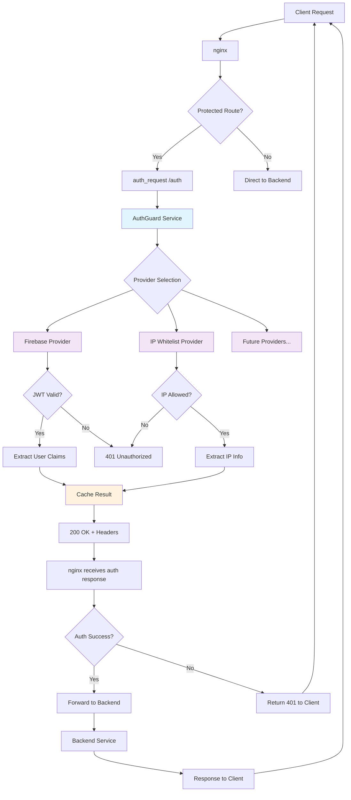

# AuthGuard 🛡️

A lightweight, high-performance authentication service designed for nginx's `auth_request` module. AuthGuard provides a **composable authentication system** with pluggable providers, built-in caching, and comprehensive monitoring.

## Features

- **🔄 Composable Authentication**: Chain multiple authentication providers for complex security requirements
- **🔥 Firebase Admin SDK**: Full Firebase authentication with automatic project ID detection  
- **🌐 IP Whitelist**: Network-based authentication for internal services
- **⚡ Caching**: In-memory and Redis caching for optimal performance
- **🚀 Production Ready**: Comprehensive logging, metrics, health checks, and graceful shutdown
- **📦 nginx Integration**: Optimized for nginx `auth_request` module with header-based provider selection
- **🐳 Docker Support**: Complete containerization with docker-compose setup
- **🏗️ Clean Architecture**: Dependency injection, interfaces, and testable code

## Architecture

AuthGuard acts as an authentication microservice that integrates with nginx's `auth_request` module. Here's how it works:



### How It Works

1. **Client Request**: Client makes request to nginx
2. **nginx Routing**: nginx checks if route requires authentication
3. **auth_request**: For protected routes, nginx calls AuthGuard via `auth_request`
4. **Provider Selection**: AuthGuard uses `X-Auth-Providers` header to determine which providers to use
5. **Authentication**: Each provider validates the request (JWT tokens, IP addresses, etc.)
6. **Caching**: Results are cached (Redis/Memory) for performance
7. **Response**: AuthGuard returns 200 (authorized) or 401 (unauthorized) with user headers
8. **nginx Decision**: nginx forwards request to backend or returns error based on auth response

### Key Benefits

- **Composable**: Chain multiple providers (`firebase,ip_whitelist`)
- **Performant**: Built-in caching reduces auth overhead
- **Scalable**: Stateless design allows horizontal scaling
- **Secure**: No auth logic in your application code
- **Flexible**: Different auth requirements per route

## Supported Providers

- ✅ **Firebase**: JWT token validation using Firebase Admin SDK
- ✅ **IP Whitelist**: Network-based authentication with CIDR support  
- 🔄 **Extensible**: Add new providers like Auth0, Keycloak, OAuth2, SAML, LDAP and use them in chaining authentication

## Composable Authentication

AuthGuard supports **multiple providers in a single request**. nginx can specify which providers to use via the `X-Auth-Providers` header:

```nginx
# Single provider (default: firebase)
proxy_set_header X-Auth-Providers "firebase";

# Multiple providers (ALL must succeed)  
proxy_set_header X-Auth-Providers "firebase,ip_whitelist";

# IP whitelist only (for internal services)
proxy_set_header X-Auth-Providers "ip_whitelist";
```

## Quick Start

### Using Docker Image

```bash
# Run with Docker (latest stable release)
docker run -p 8080:8080 dhiagharsallaoui/authguard:latest

# Or specific version
docker run -p 8080:8080 dhiagharsallaoui/authguard:v1.0.0
```

### Using Docker Compose (Development)

1. **Clone and start**:
   ```bash
   git clone https://github.com/dhia-gharsallaoui/AuthGuard.git
   cd AuthGuard
   make dev-up
   ```

2. **Configure Firebase** (optional):
   ```bash
   # Add your Firebase credentials to dev/.env
   export AUTHGUARD_FIREBASE_CREDENTIALS_BASE64="<your-base64-credentials>"
   ```

3. **Test the service**:
   ```bash
   # Health check  
   curl http://localhost:8080/health
   
   # IP whitelist authentication (works from localhost)
   curl -v http://localhost/auth/ip-only
   
   # Firebase authentication (requires valid token)
   curl -v http://localhost/auth/firebase \
     -H "Authorization: Bearer YOUR_FIREBASE_TOKEN"
     
   # Multi-provider authentication (both must succeed)
   curl -v http://localhost/auth/firebase-ip \
     -H "Authorization: Bearer YOUR_FIREBASE_TOKEN"
   ```

### Using Environment Variables

1. **Set up environment**:
   ```bash
   make setup-env    # Creates .env from template
   # Edit .env with your Firebase credentials
   source .env
   ```

2. **Run the service**:
   ```bash
   make run-env      # Builds and runs with environment
   ```

## Installation

### Docker Images

AuthGuard images are automatically built and published to Docker Hub:

```bash
# Latest stable release
docker pull dhiagharsallaoui/authguard:latest

# Specific version
docker pull dhiagharsallaoui/authguard:v1.0.0
```

**Available Tags:**
- `latest` - Latest stable release
- `v1.0.0`, `v1.1.0` - Specific versions  
- `main-<commit>` - Development builds from main branch

**Platforms:** `linux/amd64`, `linux/arm64`

### Binary Releases

Download pre-built binaries from [GitHub Releases](https://github.com/dhia-gharsallaoui/AuthGuard/releases):

```bash
# Linux
curl -L -o authguard https://github.com/dhia-gharsallaoui/AuthGuard/releases/latest/download/authguard-linux-amd64
chmod +x authguard

# Check version
./authguard --version
```

## Configuration

AuthGuard supports configuration via environment variables with automatic Firebase project ID extraction from credentials.

### Environment Variables

```bash
# Firebase Configuration (project_id auto-extracted from credentials)
AUTHGUARD_FIREBASE_CREDENTIALS_BASE64="<base64-encoded-service-account-json>"
AUTHGUARD_FIREBASE_CREDENTIALS_PATH="/path/to/service-account.json"

# IP Whitelist Configuration  
AUTHGUARD_IP_WHITELIST_ALLOWED_IPS="127.0.0.1,::1,192.168.1.0/24"
AUTHGUARD_IP_WHITELIST_PROXY_HEADER="X-Real-IP"
AUTHGUARD_IP_WHITELIST_TRUSTED_PROXIES="10.0.0.0/8,172.16.0.0/12"

# Server Configuration
AUTHGUARD_SERVER_PORT="8080"
AUTHGUARD_SERVER_HOST="0.0.0.0"

# Provider Selection (comma-separated)
AUTHGUARD_PROVIDERS="firebase,ip_whitelist"

# Cache Configuration (Redis with memory fallback)
AUTHGUARD_CACHE_TYPE="redis"                    # redis, memory, or auto-detect
AUTHGUARD_REDIS_URL="redis://:password@localhost:6379"
AUTHGUARD_REDIS_PASSWORD="your_redis_password"
AUTHGUARD_REDIS_DB="0"

# Logging
AUTHGUARD_LOG_LEVEL="info"
AUTHGUARD_LOG_FORMAT="json"

# Metrics  
AUTHGUARD_METRICS_ENABLED="true"
AUTHGUARD_METRICS_PORT="9090"
```

### Firebase Setup

AuthGuard automatically extracts the project ID from your Firebase service account credentials:

1. **Generate service account key** in Firebase Console → Project Settings → Service Accounts
2. **Base64 encode the JSON**:
   ```bash
   cat service-account.json | base64 -w 0
   ```
3. **Set environment variable**:
   ```bash
   export AUTHGUARD_FIREBASE_CREDENTIALS_BASE64="<base64-string>"
   ```

## nginx Integration

### Basic Setup

```nginx
upstream authguard {
    server authguard:8080;
}

server {
    location /auth {
        internal;
        proxy_pass http://authguard/validate;
        proxy_pass_request_body off;
        proxy_set_header Content-Length "";
        proxy_set_header Authorization $http_authorization;
    }

    location /protected {
        auth_request /auth;
        
        # Forward user information to backend
        auth_request_set $user_id $upstream_http_x_user_id;
        auth_request_set $user_email $upstream_http_x_user_email;
        
        proxy_set_header X-User-ID $user_id;
        proxy_set_header X-User-Email $user_email;
        
        proxy_pass http://your-backend;
    }
}
```

### Composable Authentication Setup

```nginx
server {
    # Firebase + IP Whitelist for admin endpoints
    location /admin {
        auth_request /auth-admin;
        # ... backend proxy
    }
    
    location /auth-admin {
        internal;
        proxy_pass http://authguard/validate;
        proxy_pass_request_body off;
        proxy_set_header Content-Length "";
        proxy_set_header Authorization $http_authorization;
        proxy_set_header X-Auth-Providers "firebase,ip_whitelist";
    }
    
    # IP Whitelist only for internal services
    location /internal {
        auth_request /auth-internal;
        # ... backend proxy  
    }
    
    location /auth-internal {
        internal;
        proxy_pass http://authguard/validate;
        proxy_pass_request_body off;
        proxy_set_header Content-Length "";
        proxy_set_header X-Auth-Providers "ip_whitelist";
    }
    
    # Firebase only for public API
    location /api {
        auth_request /auth-public;
        # ... backend proxy
    }
    
    location /auth-public {
        internal;
        proxy_pass http://authguard/validate;
        proxy_pass_request_body off;
        proxy_set_header Content-Length "";
        proxy_set_header Authorization $http_authorization;
        proxy_set_header X-Auth-Providers "firebase";
    }
}
```

## API Endpoints

### `POST /validate`

Validates authentication using the specified providers.

**Headers**:
- `Authorization: Bearer <token>` - Required for Firebase authentication
- `X-Auth-Providers: provider1,provider2` - Comma-separated list of providers (optional, defaults to firebase)

**Success Response** (200):
```
Headers:
X-User-ID: firebase-user-id
X-User-Email: user@example.com  
X-User-Name: User Name
X-User-Provider: firebase
X-Token-Expires: 2024-01-01T12:00:00Z
```

**Multi-Provider Success** includes additional metadata:
```json
Custom Claims:
{
  "auth_providers": ["firebase", "ip_whitelist"],
  "client_ip": "127.0.0.1"
}
```

**Error Response** (401):
```json
{
  "code": "INVALID_TOKEN",
  "message": "Invalid authentication token",
  "details": "token has expired"
}
```

### `GET /health`

Returns service health status including all providers.

**Response**:
```json
{
  "status": "healthy",
  "timestamp": "2024-01-01T12:00:00Z",
  "providers": {
    "firebase": {
      "status": "healthy"
    },
    "ip_whitelist": {
      "status": "healthy",
      "stats": {
        "allowed_ips": 2,
        "allowed_cidrs": 1
      }
    }
  },
  "cache": {
    "type": "redis",
    "status": "healthy",
    "stats": {
      "hits": 1250,
      "misses": 45,
      "keys": 150,
      "last_updated": "2025-08-26T10:32:11.456898399Z",
      "type": "redis"
    }
  }
}
```

## Development

### Project Structure

```
auth-nginx/
├── cmd/authguard/           # Application entry point
├── internal/
│   ├── auth/               # Core interfaces and types
│   ├── cache/              # Cache implementations  
│   ├── config/             # Configuration management
│   ├── handlers/           # HTTP handlers and server
│   ├── logging/            # Structured logging
│   ├── metrics/            # Prometheus metrics
│   └── providers/          # Authentication providers
│       ├── firebase/       # Firebase Admin SDK implementation
│       └── ip_whitelist/   # IP whitelist implementation
├── .env                    # Environment configuration
├── docker-compose.yml      # Development environment
└── Dockerfile             # Production container
```

### Adding New Providers

1. **Create provider directory**:
   ```bash
   mkdir internal/providers/myprovider
   ```

2. **Implement AuthProvider interface**:
   ```go
   type Provider struct {
       // ... your fields
   }

   func (p *Provider) Type() auth.ProviderType { return auth.ProviderTypeMyProvider }
   func (p *Provider) LoadConfig(loader auth.ConfigLoader) error { /* ... */ }
   func (p *Provider) Validate(ctx context.Context, authCtx *auth.AuthContext) (*auth.UserClaims, error) { /* ... */ }
   func (p *Provider) Health(ctx context.Context) error { /* ... */ }
   func (p *Provider) Close() error { /* ... */ }
   ```

3. **Add to provider types** in `internal/auth/provider.go`:
   ```go
   const (
       ProviderTypeUnknown ProviderType = iota
       ProviderTypeFirebase  
       ProviderTypeIPWhitelist
       ProviderTypeMyProvider  // Add here
   )
   ```

4. **Register in main.go**:
   ```go
   case auth.ProviderTypeMyProvider:
       provider := myprovider.NewProvider(logger, metrics)
       if err := authGuard.RegisterProvider(provider); err != nil {
           return fmt.Errorf("failed to register myprovider: %w", err)
       }
   ```

## AuthContext System

AuthGuard uses an `AuthContext` abstraction to support different authentication mechanisms:

```go
type AuthContext struct {
    Headers    map[string]string // HTTP headers
    Cookies    map[string]string // HTTP cookies  
    Body       io.Reader         // Request body (lazy reading)
    RemoteAddr string            // Client IP address
    Method     string            // HTTP method
    Path       string            // Request path
}
```

This allows providers to access different authentication sources:
- **Firebase**: Reads `Authorization` header for Bearer tokens
- **IP Whitelist**: Uses `RemoteAddr` and optional proxy headers
- **Future LDAP**: Could use `Authorization` header for Basic Auth
- **Future Cookie Auth**: Could read session cookies

## Contributing New Providers

AuthGuard is designed to be **composable and extensible**. You can easily contribute new authentication providers and use them in chaining authentication scenarios. Examples of providers you could add:

- **Auth0**: OAuth2/OpenID Connect integration
- **Keycloak**: Open source identity management  
- **OAuth2 Generic**: Generic OAuth2 provider support
- **SAML**: SAML 2.0 authentication
- **LDAP/AD**: Directory-based authentication
- **API Key**: Simple API key validation
- **JWT Generic**: Generic JWT token validation
- **Basic Auth**: Username/password authentication

All providers can be chained together using the `X-Auth-Providers` header, allowing complex authentication flows like "firebase,ldap" or "api_key,ip_whitelist".

## Security

- Firebase Admin SDK for secure JWT validation
- Network-based IP whitelisting with CIDR support  
- Input validation on all authentication contexts
- No sensitive data in logs
- Security headers on all responses
- Non-root container execution
- Graceful degradation when providers are unavailable
- Composable authentication for defense in depth

## Monitoring

- **Prometheus metrics** on `/metrics` endpoint
- **Structured JSON logging** with configurable levels  
- **Health checks** with per-provider status
- **Request tracing** with authentication provider information
- **Performance metrics** for each provider and overall system
- **Multi-provider metrics** showing success/failure rates per combination

## License

[Add your license here]

## Contributing

[Add contributing guidelines here]